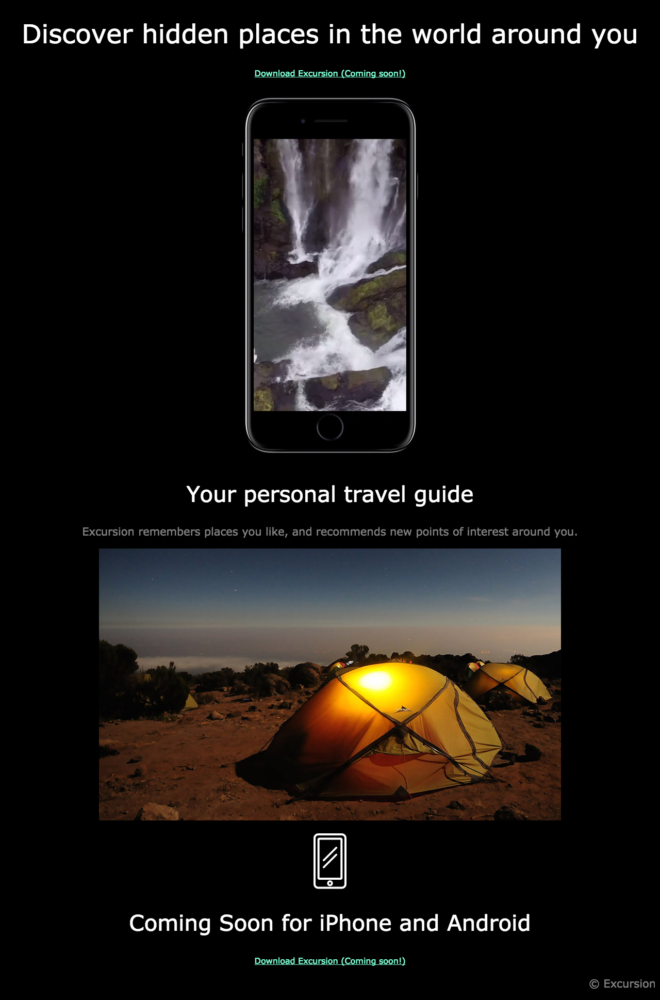

# excursion - Practice Project

## Description
A simple off platform practice project from the codecademy site.
It helped me use my HTML and CSS skills as well using git and github.   

"The web page you’ll build advertises a mobile app which helps users record and share their experiences,
so you’ll use video and landscape imagery to set the scene. A landing page is a vital tool in marketing 
a product these days, and the goal will be to entice potential customers into using the product."

## Screenshots

## Technologies used
- HTML
- CSS
- VSCODE
- GIT/GITHUB
